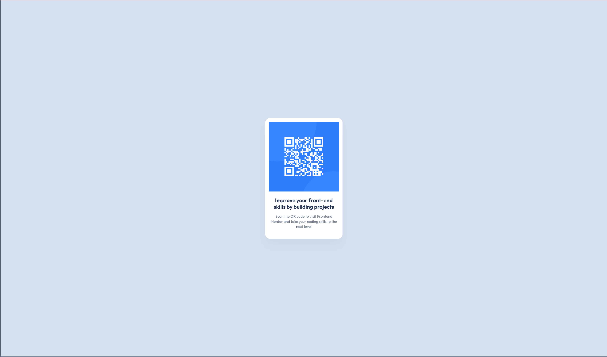

# Frontend Mentor - QR code component solution

This is a solution to the [QR code component challenge on Frontend Mentor](https://www.frontendmentor.io/challenges/qr-code-component-iux_sIO_H). Frontend Mentor challenges help you improve your coding skills by building realistic projects. 

## Table of contents

- [Overview](#overview)
  - [Screenshot](#screenshot)
  - [Links](#links)
- [My process](#my-process)
  - [Built with](#built-with)
  - [What I learned](#what-i-learned)
  - [Continued development](#continued-development)
  - [Useful resources](#useful-resources)
- [Author](#author)
- [Acknowledgments](#acknowledgments)

**Note: Delete this note and update the table of contents based on what sections you keep.**

## Overview

### Screenshot

### Links

- Solution URL: (https://github.com/antoniomontoia/QR-Code)
- Live Site URL: (https://antoniomontoia.github.io/QR-Code/)

## My process

### Built with

- Semantic HTML5 markup
- CSS custom properties
- Flexbox

### What I learned

This project provided me with a valuable opportunity to refresh my CSS and HTML skills after several months of not working with these languages. Although it was a simple project, I thoroughly enjoyed the process and it reminded me of how fun and immersive coding can be.

Working on this project not only helped me regain my confidence in front-end development but also reignited my passion for creating engaging web experiences.

### Continued development

As I continue to develop my skills, I want to focus on perfecting my CSS and HTML abilities. Specifically, I aim to adopt a more structured approach to writing code. While I appreciate the learning that comes from a trial-and-error method, I believe that being more methodical in my coding practices will lead to cleaner, more maintainable code and a deeper understanding of best practices.

By focusing on these areas, I hope to enhance my overall efficiency and effectiveness as a developer, ultimately leading to better project outcomes.

### Useful resources

- [Flexbox Malven] (https://flexbox.malven.co) - This helped me refreshing my flexbox knowledge. A very intuitive and simple cheatsheet for flexbox.

- [CSS Tricks] (https://css-tricks.com/) - This helped me with some CSS Properties I wasn't acquainted with.

- [Chrome Developer Tools] (no links) - This sounds like a no-brainer, but using developer tools can prove quite useful when it comes to troubleshooting our code.

## Author

- Frontend Mentor - [@antoniomontoia](https://www.frontendmentor.io/profile/antoniomontoia)
- Dribbble - [@franissimo](https://www.dribbble.com/franissimo)
